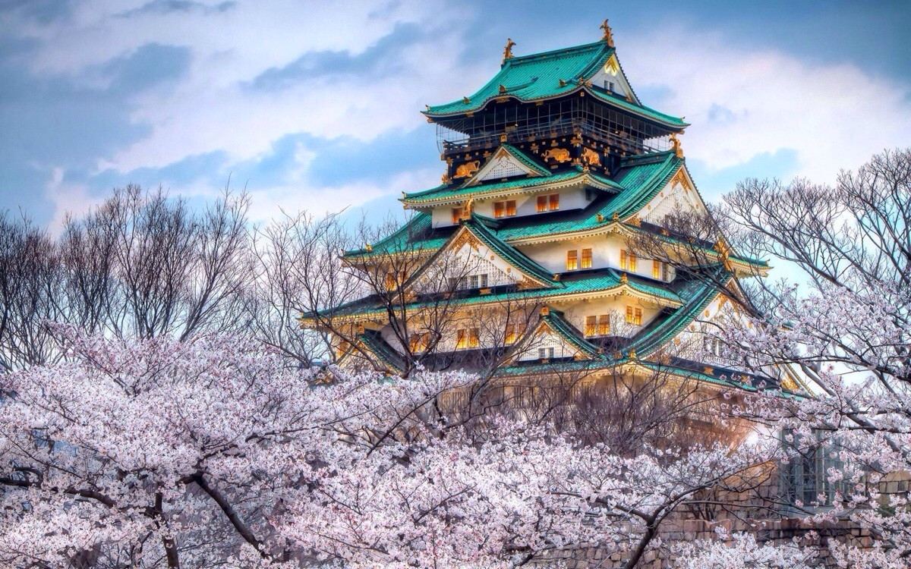
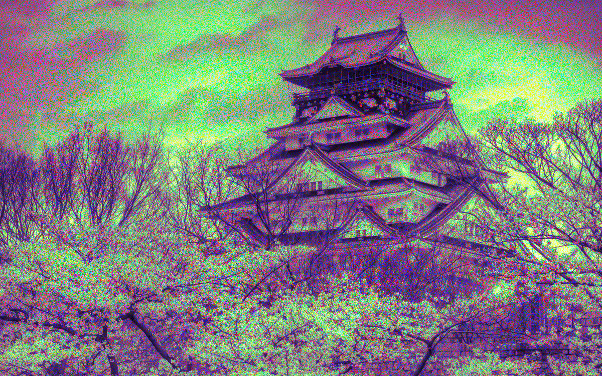
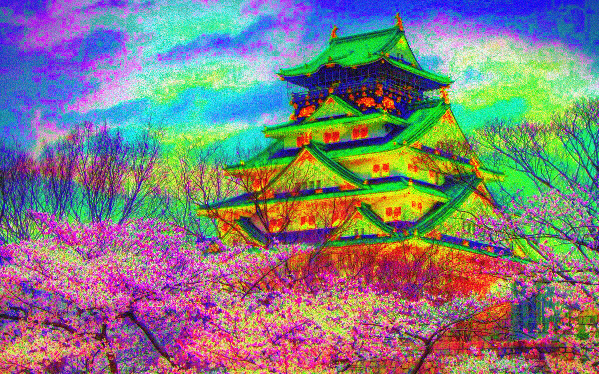
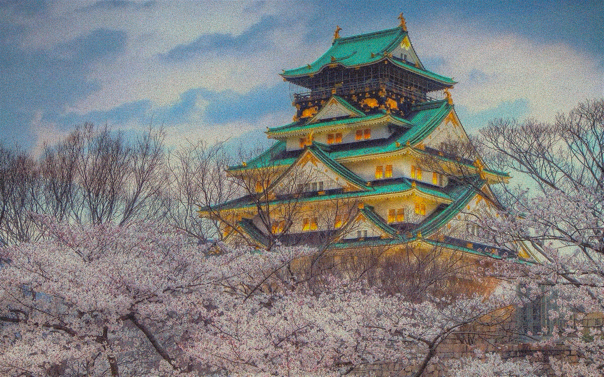
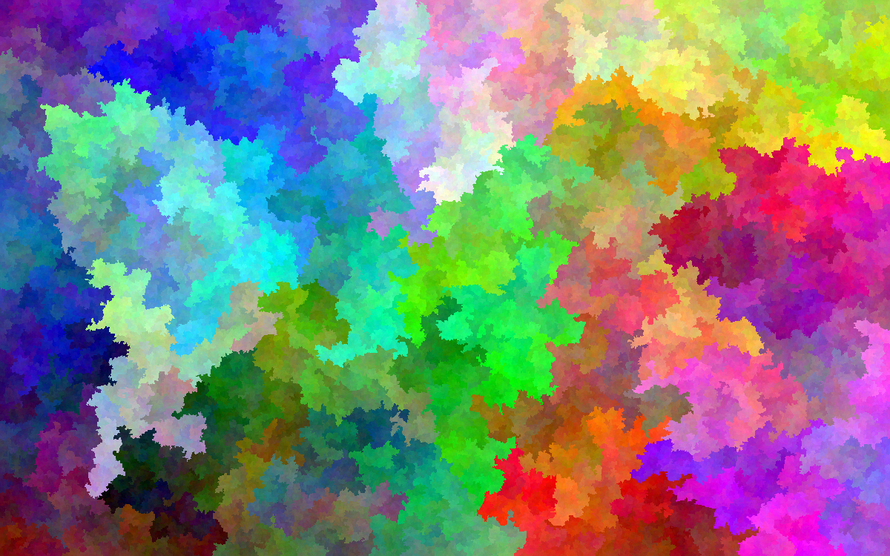
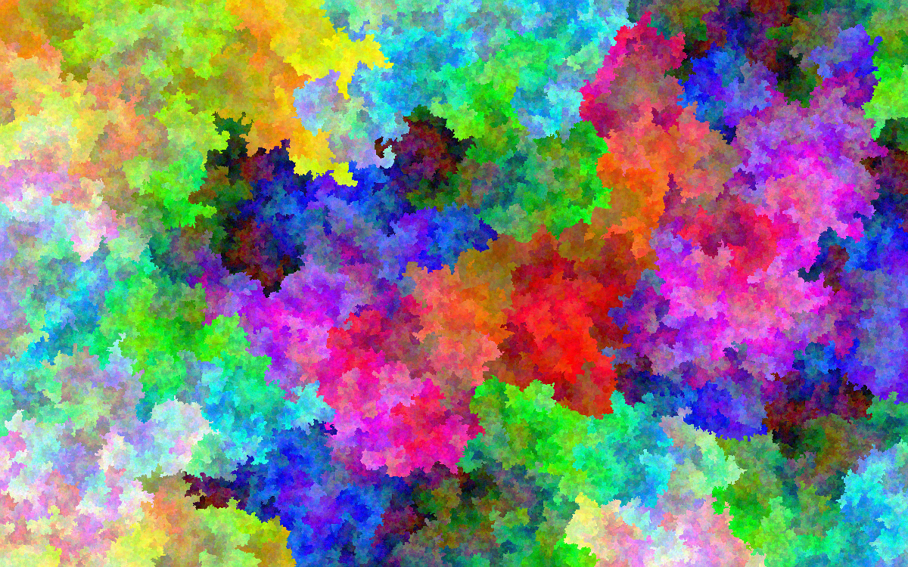

=============
image-permute
=============

Generating images with a full spectrum of colors, allRGB-style.

About
=====

There are several disucssions online (1_, 2_, 3_) about generating images where
each color in the RGB color space is used once. This is my implementation of
some ideas from each of those sites. It's not particularly novel, though I do
support images of sizes other than 2^24 while maintaining the spirit of allRGB
by evenly sampling the RGB colorspace.

.. _1: https://allRGB.com
.. _2: https://codegolf.stackexchange.com/questions/22144/images-with-all-colors
.. _3: https://possiblywrong.wordpress.com/2014/04/18/allrgb-hilbert-curves-and-random-spanning-trees/

.. warning::

    Most of this code was written while I was on vacation, sitting on a deck
    chair, looking at the ocean, possibly having a drink.

Examples
========

Starting from this input image_:

.. _image: https://www.flickr.com/photos/agustinrafaelreyes/7501177216

Ignoring hue::

    bin/permute examples/castle.png examples/ascending.png -a

Swapping pixels for a closer match::

    bin/permute examples/castle.png examples/castle-s200.png -s 200

Dithering::

    bin/permute examples/castle.png examples/castle-d300.png -d 300

No input image, just colors::

    bin/abstract 750 1200 examples/sdfs.png

A slightly different feel::

    bin/abstract 750 1200 examples/bfs.png -bfs

Building
========

Requires pnglib and a newish compiler. Clone the repo, then::

    cd image-permute
    mkdir build
    cd build
    cmake ..
    make
